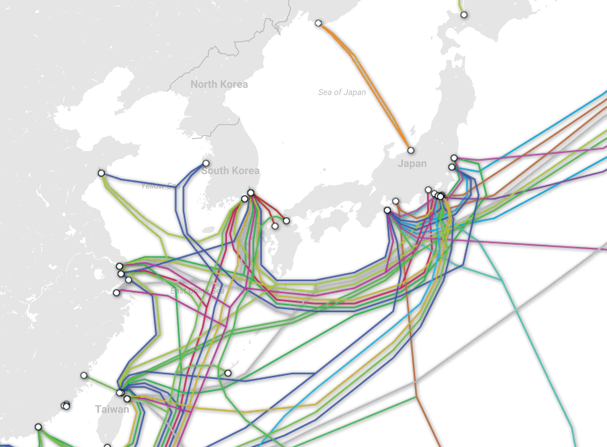

# Fastcampus 
## Frontend Dev SCHOOL
### Network(1)

---
<!--
page_number: true
$size: A4
footer : fastcampus 프론트엔드 개발 스쿨, Wooyoung Choi, 2018
-->

## Network

---
## Network

우리는 어떻게 다른 컴퓨터와 통신하고, 웹서핑을 할 수 있을까?

---
## Network
A computer network or data network is a telecommunications network which allows nodes to share resources.

--> 컴퓨터간 리소스를 공유 가능하게 만드는 통신망

---
## Charcteristics of Network
- 컴퓨터사이의 리소스를 공유
- 네트워크로 연결된 다른 컴퓨터에 접근하여 파일을 생성, 수정, 삭제할 수 있음
- 프린터와 스캐너, 팩스 등의 출력장치에 네트워크를 연결하여 여러 컴퓨터가 동시 접근 가능

---
## Requirements of Network
- Network Cable
- Distributor(Switch Hub)
- Router
- Network card

---
## 커버 범위에 따른 네트워크 구분

---
## LAN
- Local Area Network(근거리 통신망)
- 학교, 회사 등 가까운 지역의 좁은 범위

## WAN
- Wide Area Network(광역 통신망)
- 국가, 대륙 등 넓은 지역을 커버

---
## MAN
- Metropolitan Area Network(도시권 통신망)
- LAN < `MAN` < WAN

## WLAN
- Wireless Local Area Network(무선 근거리 통신망)
- IEEE 802.11 표준을 기반
- http://standards.ieee.org/about/get/802/802.11.html

---
# 802.11 == wifi ????

---
## 802.11 != wifi
802.11: IEEE에서 개발된 표준 무선통신기술
wifi: 와이파이 얼라이언스의 상표. 802.11 기술을 사용하는 무선 근거리 통신망 제품

---
## wifi


---
## wifi a, b, g, n, ac


---
## Another way of Networking

- Lifi(IEEE 802.15.7r1)
- Power line Networking(IEEE 1901)

---
## Star, Ring, Bus

---
## Network Topology


---
## Submarine Cable Map
[https://www.submarinecablemap.com/](https://www.submarinecablemap.com/)

---


---
## Ethernet
- 전세계의 사무실이나 가정에서 일반적으로 사용되는 유선 LAN에서 가장 많이 활용되는 기술 규격
- ether == 에테르 == 빛의 매질
- IEEE 802.3 규약 기반
- OSI 7 Layer에서 Data-link Layer 에 위치

---
## Network OSI 7 layer
- `O`pen `S`ystems `I`nterconnection Reference Model
- 국제 표준화기구에서 개발한 컴퓨터 네트워크 프로토콜 디자인과 통신을 계층으로 나누어 설명한 것

---
## Packet
- 데이터를 한번에 전송할 단위로 자른 데이터의 묶음 혹은 그 크기
- 1492 ~ 1500 bytes(프로토콜에 따라 다름)
- 네트워크에서는 바이트(byte)라는 표현 대신 옥텟(octet)으로 표현

---
## Network OSI 7 layer


---
### Application Layer
- 사용자에게 네트워크 자원에 대한 접근을 제공
- 네트워크 활동들에 대한 모든 기본적인 인터페이스를 제공
- 사용자에게 보이는 유일한 계층

---
### Presentation Layer
- 응용 계층으로 부터 전송 받거나 전달되는 데이터의 인코딩과 디코딩
- 안전하게 데이터를 사용하기 위해 몇 가지 암호화와 복호화 형식 보유

---
### Session Layer
- 두 대의 컴퓨터 사이의 세션이나 대화(Dialogue)를 관리
- 모든 통신 장비를 연결하고 관리하며 종료
- 순간적으로 연결이 끊어지는 것을 막고 호스트 사이의 연결을 적절하게 종료시키기 위한 기능과 연결이 단방향인지 양방향인지에 대한 것을 담당

---
### Transport Layer
- 아래 계층에 신뢰성 있는 데이터를 전송할 수 있게 함
- 흐름 제어, 분할, 재조립, 오류 관리를 포함하지만 전송 계층은 지점과 지점 간의 오류가 없음을 보장
- 연결 지향적인 프로토콜과 비연결 지향적인 프로토콜을 제공하며, 방화벽과 프록시 서버가 이 계층에서 동작

---
### Network Layer
- 가장 복잡한 OSI 계층 중 하나로, 물리적인 네트워크 사이의 라우팅을 담당 하며, 라우터가 이 계층에서 동작
- 네트워크 호스트의 논리적인 주소(IP 주소같은)를 관리하고 패킷을 분할해 프로토콜을 식별하는 기능, 오류 탐지 같은 몇 가지 경우를 담당

---
### Datalink Layer
- 물리적인 네트워크 사이의 데이터 전송을 담당
- 물리적인 장비를 식별하는 데 사용되는 주소 지정 체계(Addressing Schema)와 데이터가 변조되지 않았음을 확증하기 위한 오류 확인을 제공
- 브리지와 스위치가 이 계층에서 동작하는 물리적인 장비

---
### Physical Layer
- 네트워크 데이터가 전송될 때 사용되는 물리적 매개체
- 전압, 허브, 네트워크 어댑터, 리피터, 케이블 명세서를 포함해 모든 하드웨어의 물리적이고 전자적인 특성을 정의
- 연결을 설정하고 종료하며, 공유된 통신 자원을 제공하고, 아날로그를 디지털로, 디지털을 아날로그로 변환

---


---
## Network OSI 7 layer


---
## Network OSI 7 layer


---
## HTTP
HyperText Transfer Protocol

- www상에서 정보를 주고받는 프로토콜
- TCP, UDP를 활용함
- HTTP method: GET, POST, PUT, DELETE

---
## FTP
File Transfer Protocol
- 서버와 클라이언트 사이에 파일전송을 위한 프로토콜
- but, 보안에 매우 취약(패킷 가로채기, 무차별 대입, ...)
- 현재는 FTPS(FTP-SSL), SFTP(simple FTP), SSH(Secure SHell) 등을 사용

---
## SMTP
Simple Mail Transfer Protocol
- Internet에서 메일을 보내기 위한 프로토콜

---
## TCP/IP
Transmission Control Protocol / Internet Protocol
- 전송제어 프로토콜 + 송수신 호스트의 패킷교환을 위한 프로토콜

---
## TCP
- 전송제어프로토콜 / Transmission(Transfer) Control Protocol
- 근거리 통신망이나 인트라넷, 인터넷에 연결된 컴퓨터에서 실행되는 프로그램 간에 일련의 옥텟(==byte)을 안정적으로, 순서대로, 에러없이 교환할 수 있게 함

---
### STREAM
- 문자형식의 데이터가 열의 형태로 연속성을 띄게 됨

### DATAGRAM
- 하나의 패킷이 발신지와 수신지 정보를 모두 담고 있는 독립적인 패킷

---
### STREAM socket
- 연결형 스트림 소켓은 `두개의 시스템`이 `연결된 후` 데이터를 `교환`
- 패킷 순서 신경쓰지 않아도 되어 안정적인 데이터 전송 가능

### DATAGRAM socket
- 비연결형 데이터그램 소켓은 명시적으로 `연결되지 않은 상태`로 데이터를 주고 받음
- 연결과 해제 과정이 없어 빠른 데이터 교환이 가능

---
## IP
## IPv4, IPv6

- Internet Protocol version 4
	- 32bit로 구성
	- 0.0.0.0 ~ 255.255.255.255
	- 0000 0000.0000 0000. 0000 0000. 0000 0000 
	- `2^32`=`42.9억`
	- 5개의 클래스를 가지며, 상위 3개의 클래스를 가짐
		- A(1~126)
		- B(128~191.XXX)
		- C(192~223.XXX.XXX)
		- D()
		- E()

---
## 127.0.0.1 vs 192.168.0.x

### 127.0.0.1
- Loopback: 컴퓨터가 가지고 있는 무조건 반대신호를 반환하는 대역
- Localhost

### 192.168.0.x
- LAN에서 라우터가 할당한 내컴퓨터의 IP address

---
## Global IPv4 depletion 


---
## Let's Count Number
10^4 = `만`
10^8 = `억`
10^12 = `조`
10^16 = `경`
10^20 = `해`
10^24 = `자`
10^28 = `양`
10^32 = `구`
10^36 = `간`

---
## IPv4, IPv6

- Internet Protocol version 6
	- 128bit로 구성
	- 0000:0000:0000:0000:0000:0000:0000:0000 ~ FFFF:FFFF:FFFF:FFFF:FFFF:FFFF:FFFF:FFFF
	- `2^128`=`16*16*16*16*16*16^8`=`340,282,366,920,938,463,463,374,607,431,768,211,456`=`3.4*10^38`

---
## Public, Private
### Public IP address(Internet IP address)
- Globally Unique

### Private IP address(Local IP address)
- Private network 내에서 유효


---
## DNS
- Domain Name System
- 외우기 힘들며, 더 힘들어질 ip address를 사람이 판별하기 쉬운 url을 매핑하는 시스템

---
## ipconfig / ifconfig

현재 컴퓨터와 연결된 네트워크 정보를 확인할 수 있음

---
## Subnetmask
- 커다란 네트워크를 효율적으로 분배하여 사용하기 위한 방법
- 할당받은 하나의 IP주소를 네트워크 환경에 맞춰 적절히 나누어줌
- IPv4 기준 2진수로 구성
- 255.255.255.255
- 1111 1111 . 1111 1111 . 1111 1111 . 1111 1111

---
## UDP
User(Universal) Datagram Protocol
- 데이터그램을 전송하기 위한 프로토콜
- 메시지 수신확인x, 도착순서 예측x
- 빠른 속도, 적은 오버헤드

---
## TCP vs UDP segment


---
## Web Programming

---
### 웹 개발 패턴의 변화

- 1991 ~ 1999: Sir Timothy John "Tim" Berners-Lee가 하이퍼텍스트 기반의 프로젝트를 제안한 이후 정적인 컨텐츠들을 중심으로 한 웹 기술이 발달
- 1999 ~ 2009: Linux, Apache, Mysql, Php 중심의 동적인 서버, 정적인 클라이언트 모델이 지속됨
- 2010 ~ 현재: javaScript!! (Dynamic Web Client)

---
### 웹 개발 패턴의 변화

```html
<html>
<head></head>
<body>
<h1>Static Header</h1>
<div>Static Contents</div>
</body>
</html>
```

- 1991 ~ 1999: Sir Timothy John "Tim" Berners-Lee가 하이퍼텍스트 기반의 프로젝트를 제안한 이후 정적인 컨텐츠들을 중심으로 한 웹 기술이 발달


---
### 웹 개발 패턴의 변화

```html
<html>
<head></head>
<body>
<h1></h1>
<div></div>
</body>
</html>
```

- 1999 ~ 2009: Linux, Apache, Mysql, Php 중심의 동적인 서버, 정적인 클라이언트 모델이 지속됨

---
### 웹 개발 패턴의 변화

```html
<html>
<head>
<script src="https://unpkg.com/vue"></script>
</head>
<body>
<h1>{{ header }}</h1>
<div id="app">
  {{ message }}
</div>
<script>
var app = new Vue({
  el: '#app',
  data: {
    message: '안녕하세요 Vue!'
  }
})
</script>
</body>
</html>
```

- 2010 ~ 현재: javaScript!! (Dynamic Web Client)


---
## Web Browser

---
## Mosaic(1993)


---
## Netscape Navigator(1994)


---
## Internet Explorer(1995)


---
## FireFox(2004)


---
## Chrome(2008)


---
### PWA in Chrome Dev Summit 2017
[schedule](https://developer.chrome.com/devsummit/schedule)
<iframe width="640" height="360" src="https://www.youtube.com/embed/_sLa0qhuqcA" frameborder="0" allowfullscreen></iframe>

---
### Web architecture


---
## 웹 개발의 현재
### javaScript

---
## Client-side
- HTML/CSS, javaScript
- jQuery, AJAX
- Front-end Web Framework
	- AngularJS
	- React.js
	- Vue.js
- CSS Framework
	- Bootstrap
	- Foundation

---
## Server-side
- Depends on Language
	- PHP: Laravel
	- javaScript: Node.js(Express.js)
	- Java: Spring
	- C++, C#: ASP.net
	- Python: Django, Flask
	- Golang: itself
	- Ruby: Ruby on Rails

---
## Database
- RDBMS
	- MySQL
	- PostgreSQL
	- MariaDB
- noSQL
	- MongoDB
	- CouchDB
	- Redis


---
## etc
- celery (for Distributed Task Queue)
- github, Bitbucket, gitlab (for SCM)
- travis CI or jenkins (for Continuous Integration)
- slack, trello


---
## URI, URL, URN

### URI 
- Uniform Resource Information
- `https://www.example.com/post/how-to-make-url`
### URL 
- Uniform Resource Locator
- `https://www.example.com/post/`

### URN 
- Uniform Resource Name
- `www.example.com/post/how-to-make-url`
