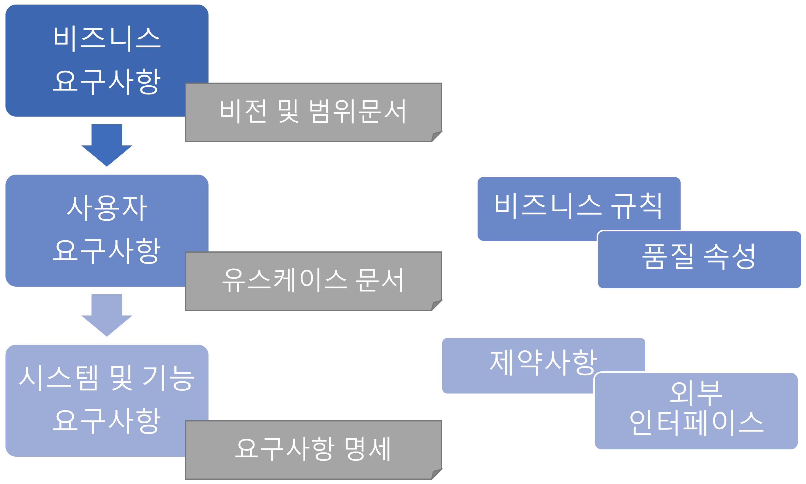

# Fastcampus 
## Frontend Dev SCHOOL
### Software Engineering(1), Database

---
<!--
page_number: true
$size: A4
footer : fastcampus 프론트엔드 개발 스쿨, Wooyoung Choi, 2018
-->

## Software Engineering

---
## Software Engineering
### Definition

Software engineering (SWE) is the application of engineering to the design, development, implementation, testing and maintenance of software in a systematic method.
--> 소프트웨어의 개발, 운용, 유지보수 등의 생명 주기 전반을 체계적이고 서술적이며 정량적으로 다루는 학문

---
## Software Engineering


### Why??

---
## Development vs Implementation

- Development
	- The process of analysis, design, coding and testing software.
- Implementation
	- The installation of a computer system or an information system.
	- The use of software on a particular computer system.

---
## Trend of Software Engineering

- Acceleration of **DevOps** adoption
- Continued wave of everything natively mobile
- Greater demand for increased privacy
- Cloud computing will be a thing of the past
- integration with Web and Mobile App

---
## DevOps

used to refer to a set of practices that emphasizes the **collaboration and communication** of both software developers and other information-technology (IT) professionals while automating the process of software delivery and infrastructure changes. 
It aims at establishing a **culture** and **environment** where building, testing, and releasing software can happen **rapidly**, **frequently**, and more **reliably**.

---
## DevOps

- 기존의 개발과 운영 분리로 인해 발생하는 문제들
문제 발생 -> 비방 -> 욕 -> 상처 -> 원인분석 -> 문제해결

- 좋은 소프트웨어를 위한 필수조건
	- 기획팀과의 원활한 소통으로 요구사항을 충실히 반영
	- 운영팀과의 원활한 소통으로 소비자 불만과 의견을 반영

---
## DevOps

운영과 개발을 통합하여 커뮤니케이션 리소스를 줄이고, 개발 실패 확률을 줄임과 동시에 보다 안정적인 서비스를 운영할 수 있음!!


---
## Software Development Life Cycle

---
## Requirements Analysis

---
## Requirements
> 무엇이 구현되어야 하는가에 대한 명세

시스템이 어떻게 동작해야 하는지 혹은 시스템의 특징이나 속성에 대한 설명

---
## Requirements Analysis
시스템 공학과 소프트웨어 공학 분야에서 수혜자 또는 사용자와 같은 다양한 이해관계자의 상충할 수도 있는 요구사항을 고려하여 새로운 제품이나 변경된 제품에 부합하는 요구와 조건을 결정하는 것과 같은 업무

---
## Requirements Analysis

나(개발자)와 클라이언트(사장) 모두를 만족시키기 위한 연결고리

---
## Requirements Analysis
- 요구사항 유도(수집): 대화를 통해 요구사항을 결정하는 작업
- 요구사항 분석: 수집한 요구사항을 분석하여 모순되거나 불완전한 사항을 해결하는 것
- 요구사항 기록: 요구사항의 문서화 작업

---
## Requirements Layer


---
## Business Requirements
> "Why"

---
## Business Requirements
> "왜" 프로젝트를 수행하는지
- 고객이 제품을 개발함으로써 얻을 수 있는 이득
- Vision and Scope(비전과 범위)

---
## User Requirements
> "What"

---
## User Requirements
> 사용자가 이 제품을 통해 할 수 있는 "무엇"
- Use cases, Scenarios, User stories, Event-response tables, ..

---
### use case diagram


---
### user scenario


---
### user stories


---
## Functional Requirements
> "What"

---
## Functional Requirements
> 개발자가 이 제품의 "무엇"을 개발할 것인지
- '~ 해야 한다' 로 끝나 반드시 수행해야 하거나 사용자가 할 수 있어야 하는 것들에 대해 작성

---
## System Requirements
- 여러개의 서브 시스템으로 구성되는 제품에 대한 최상위 요구사항을 설명
- 컴퓨터: 모니터 + 키보드 + 마우스 + 본체 + 스피커

---
## Business Rules
- 비즈니스 스트럭쳐의 요구나 제약사항을 명세
- "유저 로그인을 위해서는 페이스북 계정이 있어야 한다."
- "유저 프로필 페이지에 접근하기 위해서는 로그인되어 있어야 한다"

---
##  Quality Attribute
- 소프트웨어의 품질에 대해 명세
- "결제과정에서 100명의 사용자가 평균 1.5초의 지연시간 안에 요청을 처리해야 한다"

---
## External Interface
- 시스템과 외부를 연결하는 인터페이스
- 다른 소프트웨어, 하드웨어, 통신 인터페이스, 프로토콜, ..

---
## Constraint
- 기술, 표준, 업무, 법, 제도 등의 제약조건 명세
- 개발자들의 선택사항에 제한을 두는 것


---
## When the well is full, it will run over.

---
## 지나치게 자세한 명세작성
- 명세서는 말 그대로 명세일 뿐, 실제 개발 단계에서 마주칠 모든 것을 담을 수 없음
- 개발을 언어로 모두 표현할 수 없음
- 명세서가 완벽하다고 해서 상품도 완벽하리란 보장은 없음
- 때로는 명세를 작성하기 보단 프로토타이핑이 더 간단할 수 있음.

---
## Software Development Lifecycle Process Model

---
## Build-fix Model


---
## Build-fix Model

설계없이 일단 개발, 만족할 때까지 수정

시작이 빠름

계획이 정확하지 않음, 개발 문서가 없고 진행상황 파악이 힘듦

---
## Waterfall Model


---
## Waterfall Model

순차적인 개발 모델, 가장 많이 사용됨

정형화된 접근 가능, 체계적인 문서화 가능

직전 단계가 완료되어야 진행 가능


---
## Prototype Model


---
## Prototype Model

고객 요구사항을 적극적으로 반영하는 모델

빠른 개발과 고객 피드백을 빠르게 반영할 수 있음

대규모 프로젝트에 적용하기 힘듦

---
## Spiral Model


---
## Spiral Model

대규모 or 고비용 프로젝트

프로젝트의 위험요인을 제거해 나갈 수 있음

각 단계가 명확하지 않음

---
## 이외에도..
- RAD(Rapid Application Development) Model
- Iterative Development Model
- V Model
- Component Based Development

---
## Software Development Process
in Agile
### UP(Unified Process)
- 도입(분석위주), 상세(설계위주), 구축(구현위주), 이행(최종 릴리즈)의 반복

### XP(eXtreme Process)
- 스크럼 마스터가 주도적으로 프로세스를 주도하며, 고객과 개발자 사이의 소통을 중시함
- Product Owner와 Development Team, Customer로 롤을 구분하고 각자의 역할에 충실
- TDD 중시

---
##  TDD
### Test Driven Development

- 객체지향적
- 재설계 시간 단축
- 디버깅 시간 단축
- 애자일과의 시너지(사용자 중심적)
- 테스트 문서 대체
- 추가 구현 용이

---
## Database

## data
- 컴퓨터가 처리할 수 있는 문자, 숫자, 소리, 그림 따위의 형태로 된 정보.
- Latin "Datum"의 복수형 "Data"에서 유래

---
## Database
- 체계화된 데이터의 모임
- 여러 응용 시스템들의 통합된 정보들을 저장하여 운영할 수 있는 공용 데이터들의 묶음

---
## DB?? DBMS??

DBMS(DataBase Management System)
- 데이터의 모임인 Database를 만들고, 저장, 관리 할 수 있는 기능을 제공하는 응용프로그램
- Oracle, Mysql, MariaDB, DB2, MS SQL Server, ..


---
## DBMS의 조상님


---
## DBMS의 조상님
dBASE
- 마이크로컴퓨터용 최초의 DBMS
- 1979년 Ashton이 개발
- SQL이 아닌 독자 스크립트 언어로 실행 -> dbf 파일 생성

---
## Characteristics
- 데이터의 무결성
- 데이터의 중복 방지
- 보안(추상화, 접근권한)
- 성능 향상
- 프로그램 수정과 유지 보수 용이

---
## Differences between DataBase & File System
자기기술성

File System
- .hwp -> 한글
- .doc -> Microsoft Word
- .xls -> Microsoft Excel

DB
- Only SQL(RDBMS)

---


---


---
## SQL(Structured Query Language)

데이터 관리를 위해 설계된 특수 목적의 프로그래밍 언어


---
## SQL - 데이터 정의언어
데이터를 정의

CREATE - DB 개체 정의
DROP - DB 개체 삭제
ALTER - DB 개체 정의 변경

---
## SQL - 데이터 조작언어
데이터 검색, 등록, 삭제, 갱신

INSERT - 행, 테이블 데이터 삽입
UPDATE - 테이블 업데이트
DELETE - 특정 행 삭제
SELECT - 테이블 검색 결과 집합

---
## SQL - 데이터 제어언어
데이터 액세스 제어

GRANT - 작업 수행권한 부여
REVOKE - 권한 박탈

---
## RDBMS vs NoSQL
|구분|RDBMS|NoSQL|
|:--:|:--:|:--:|
|형태|Table|Key-value, Document, Column|
|데이터|정형 데이터|비정형 데이터|
|성능|대용량 처리시 저하|잦은 수정시 저하|
|스키마|고정|Schemeless|
|장점|안정적|확장성, 높은 성능|
|유명|Mysql, MariaDB, PostgreSQL|MongoDB, CouchDB, Redis, Cassandra |

---
## RDBMS
[PostgreSQL Docs](https://www.postgresql.org/docs/9.1/static/ddl-basics.html)
[MariaDB Docs](https://mariadb.com/kb/en/mariadb/basic-sql-statements/)

|name| age|
|:--:|:--:|
|John|  17|
|Mary|  21|

```python
rdb = 
{
	name:[John, Mary],
	age:[17, 21]
}
```

---
## 
`Table` == Relation
|`Primary Key`|`Attribute1`|Attr2|Attr3|Attr4|
|:--:|:--:|:--:|:--:|:--:|
|`Tuple1`|||||
|Tuple2|||||
|Tuple3|||||
|Tuple4|||||

---
## NoSQL
[MongoDB Docs](https://docs.mongodb.com/manual/core/document/)
```python
nosql = 
[
	{
		name:John, 
		age:17
	},
	{
		name:Mary, 
		age:21
	},

	...
]
```

---
## Document vs Key-value
```
document
{
	key: value,
	key: {
		key: value,
		key: value
		}
}
```
```
key-value
{
	key: value,
	key: value,
	key: value
}
```

---
## How to Design Database?

---
## Schema
- Database의 구조와 제약조건에 대한 전반적인 명세 기술
- Database의 Bluprint
- 외부(서브)스키마, 개념스키마, 내부스키마로 구성

---
### 외부(서브) 스키마
- 프로그램 사용자가 필요로 하는 데이터베이스의 논리적인 구조를 정의


---
### 개념 스키마
- 조직 전체의 관점에서의 구조와 관계를 정의
- 외부 스키마의 합과 그 사이의 데이터의 관계 등등
- 일반적인 스키마의 정의


---
### 내부 스키마
- 저장장치의 입장에서 데이터베이스가 저장되는 방법을 기술

---
## 


---
## Design Database

|`Primary Key`|`Attribute1`|Attr2|Attr3|Attr4|
|:--:|:--:|:--:|:--:|:--:|
|`Tuple1`|||||
|Tuple2|||||
|Tuple3|||||
|Tuple4|||||

---
## SQLite


---
## SQLite with python

---
## SQLite - check sqlite version
```python
$ python
>> import sqlite3
>> sqlite3.version
>> sqlite3.sqlite_version
```

---
## SQLite - Create table
```python
$ sqlite3 users.db
sqlite> .tables
sqlite> .exit

$ vi users.db
```

---
## SQLite - Create table & Insert User
```
$ sqlite3 user.db
SQLite version 3.16.0 2016-11-04 19:09:39
Enter ".help" for usage hints.
sqlite> CREATE TABLE user (
   ...> id integer primary key autoincrement,
   ...> name text not null,
   ...> age integer,
   ...> lang text);
sqlite> INSERT INTO user ( name, age, lang)
   ...> VALUES('Fastcampus', 3, 'Python');
sqlite> .tables
user
sqlite> SELECT * FROM user;
1|Fastcampus|3|Python
sqlite> .exit
```

---
## SQLite - insert data

- sqlite3.connect 메소드를 이용해서 DB 파일에 연결한 후 'Connection' 객체를 생성한다.
- Connection객체를 통해 Cursor 객체를 생성한다.
- 'Cursor' 객체의execute 메소드를 통해서 query를 실행한다.
- 'Connection' 객체의 commit를 이용하여 변경된 내용을 commit한다.
- DB와의 연결을 닫는다.

---
## Install MongoDB, Robomongo
[MongoDB](https://www.mongodb.com/download-center?jmp=nav#community)
[Robomongo](https://robomongo.org/download)