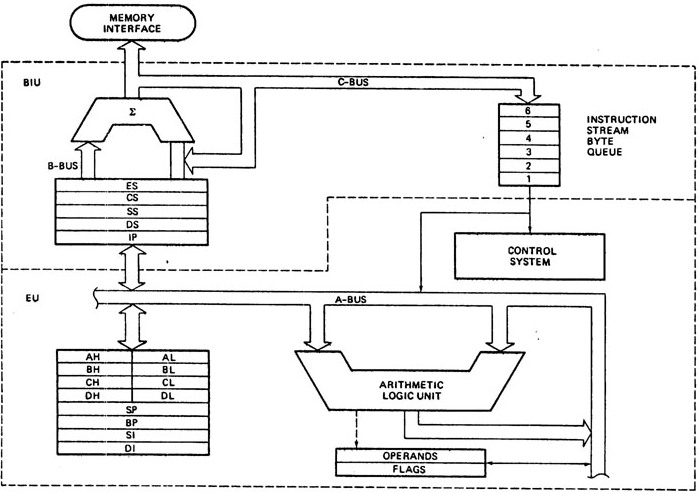
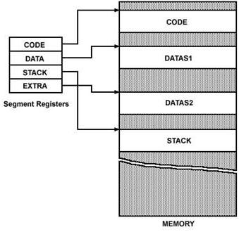
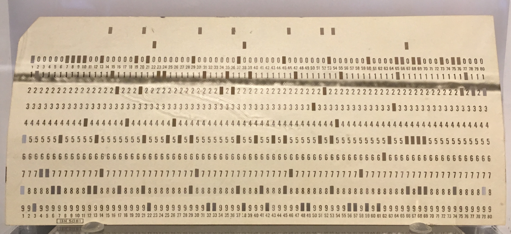

# Fastcampus 
## Web Programming & Frontend Dev SCHOOL
### Intro to Computer Science

---
<!--
page_number: true
$size: A4
footer : fastcampus 웹 프로그래밍 & 프론트엔드 개발 스쿨, Wooyoung Choi, 2017
-->
## Introduce
### 최우영

- Solution Architect, Web Developer, Instructor
- Skills: Python, Golang, Julia, Node.js, Google tag manager ...

#### blog: https://blog.ulgoon.com/
#### github: https://github.com/ulgoon/
#### email: me@ulgoon.com

---
## 수업을 본격적으로 시작하기 전

---
## Goal
- 컴퓨터를 이해하고, 메모리 구조체계에 대해 이해할 수 있다.
- 버전관리의 중요성을 절감하고, git을 활용해 버전관리를 할 수 있다.
- github으로 git을 관리하고, 나만의 블로그를 생성할 수 있다.

---
## understanding of computer systems

---
## What is Computer?

---
## What is Computer?
`Compute` + `er`

---
### Computation vs Calculation

`"calculation"` implies a strictly arithmetic process, 
whereas `"computation"` might involve applying rules in a systematic way

---
### Computer vs Calculator

- `Stored Program` computer -> Computer
	- Stores and Executes intructions
- `Fixed Program` computer -> Calculator
	- just calculate

엇? 그럼 공학용 계산기는???

---
### Computer Science and Engineering
- 컴퓨터의 소프트웨어를 다루는 학문
- 컴퓨터라는 물리적 기기를 연구하는 것이 아닌 `Compute`r 의 개념과 구조를 이해하고 구현하는 학문

---
### Computer


---
### Basic Computer Architecture


---
### Basic Computer Architecture
- Program Counter - contains the address (location) of the instruction being executed at the current time
- ALU(Arithmetic Logic) - `+, -, *, /, AND, OR, NOT, `

---
### CPU and MicroProcessor


---


---
### Architecture Naming
- x86

8080 - 8bit

8086 - 16bit

8088 - 8bit
80286 - 16bit

80386 - 32bit
..

---
### Architecture Naming

- IA64

Itanium - IA64 based 64bit, 1999
...

- AMD64

Opteron - x86-64based 64bit, 2003
Athlon
AMD Phenom
AMD FX
Ryzen
..

- ~~Intel64~~ == AMD64

Xeon - x86-64 based 64bit, 2004
Core 2
Core i Series
..


---
### Block Diagram of 8086


---
### Memory Segments of 8086


---
### CISC&RISC Architecture
- Complex Instruction Set Computers
	- 복잡한 명령구조
	- 어드레싱에 강점
	- 전력 신경쓸 필요없이 고성능 컴퓨팅에 사용
	- Intel x86, AMD64, .. 
- Reduced Instruction Set Computers
	- 명령어의 단순화
	- 메모리 접근 횟수가 적음
	- 저전력 프로세싱에 사용
	- SPARC, ARM, ..

---
### Memory


---
### Memory
- 컴퓨터에서 사용할 수 있도록 정보를 저장하는 공간


---
- Random Access Memory
	- 자유롭게 읽고 쓸 수 있는 주기억장치
	- 메모리의 주소로 그 위치에 접근
	- RAM의 어떤 위치로든 같은 시간에 접근(Random Access)
	- 컴퓨터가 느려지면 재부팅을 하세요!


---
- Read Only Memory
	- 전원이 공급되지 않아도 그 정보를 유지하는 주기억장치
	- 비싸거나 느려서 안정적인 정보를 저장해야 할 때 사용
	- BIOS, OS, Firmware 정보 저장에 쓰임


---
### OS
- Operating System: 운영체제
- 시스템 하드웨어와 응용 소프트웨어(한글, excel, ..)의 리소스를 관리하는 시스템 소프트웨어

---
### Type
- Single-tasking / Multi-tasking
	- 한번에 1개 / n개 의 프로그램을 동시 수행(achieved by time-sharing)
- Single-user / Multi-user
- Distributed

Hardware <--> `Operating System` <--> Application Software <--> User

---
### Chronicles of OS

#### Unix
- Starting in the 1970s by AT&T
- Ken Thompson, Denis Ritchie, ..

#### Unix-like
- Solaris
- BSD
- MacOS

---
#### Linux
- Unix-clone OS 
- GNU/Linux
- Sep 17 1991 by Linus Torvalds

`GNU is not Unix`

- Ubuntu
- Fedora
- CentOS
- Debian
- Linux Mint
- ..

---
#### Linux-like
- Android
- Tizen
- Chrome OS
- ..

---
#### Windows
- CP/M-DOS -> MS-DOS
- Windows 1
- ..
- Windows 10
- Windows 95
- Windows 98
- Windows 2000

---
#### Windwos 9x vs Windows NT
MS-DOS based -> 16bit
WindwosNT Kernel(3.1) based -> 32bit
WindwosNT Kernel(6.1) based -> x86-64(AMD64)


---
### Patch & Debug

---


---


---


---
## VCS (Version Control System)
== SCM (Source Code Management)
< SCM (Software Configuration Management: 형상관리)

---
## chronicle of git


---
## chronicle of git
- Linux Kernal을 만들기 위해 Subversion을 쓰다 화가 난 리누스 토발즈는 2주만에 git이라는 버전관리 시스템을 만듦
[git official repo](https://github.com/git/git)

---
## Characteristics of git
- 빠른속도, 단순한 구조
- 분산형 저장소 지원
- 비선형적 개발(수천개의 브랜치) 가능

---
## Pros of git
- **중간-발표자료_최종_진짜최종_15-4(교수님이 맘에들어함)_언제까지??_이걸로갑시다.ppt**


- 소스코드 주고받기 없이 동시작업이 가능해져 생산성이 증가
- 수정내용은 **commit** 단위로 관리, 배포 뿐 아니라 원하는 시점으로 **Checkout** 가능
- 새로운 기능 추가는 **Branch**로 개발하여 편안한 실험이 가능하며, 성공적으로 개발이 완료되면 **Merge**하여 반영
- 인터넷이 연결되지 않아도 개발할 수 있음

---
## Open-source project

https://github.com/python/cpython
https://github.com/tensorflow/tensorflow

https://github.com/JuliaLang/julia
https://github.com/golang/go

---
## git inside
- Blob: 모든 파일이 Blob이라는 단위로 구성 
- Tree: Blob(tree)들을 모은 것
- Commit: 파일에 대한 정보들을 모은 것

---
## git Process and Command


---
## Useful manager for mac
http://brew.sh/index_ko.html


---
### install git
https://git-scm.com/

```shell
// MacOS
$ brew install git
// Linux
$ sudo apt-get install git
```

- Windows: install [git bash](https://git-scm.com/)

`$ git --version` 으로 정상적으로 설치되었는지를 확인


---
## git is not equal to github


---
### sign up github
https://github.com/


**important!!**
- 가입할 `email`과 `username`은 멋지게
- private repo를 원한다면 $7/month

---
## Important github User Interface

---
### Star


### watch


---
## Set configuration
terminal
```shell
$ git config --global user.name "username"
$ git config --global user.email "github email address"
$ git config --list
```

---
## My First Repo
Let's make your first repo with github

---
## My First Repo
`$ git init`
`$ git add .`
`$ git commit -m "some commit"`

After create new repo through github,

`$ git remote add origin https://github.com/username/repo.git`
`$ git push origin master`

---
## github pages

---
## My First Github Pages
github 저장소를 활용해 정적인 사이트 호스팅이 가능

`username`.github.io 
http://tech.kakao.com/
https://spoqa.github.io/

---
### sample index page
After create new repo throuch github,

`$ git clone https://github.com/username/username.github.io.git`

Create New file `index.html`

`$ git add .`
`$ git commit -m "first page"`
`$ git push origin master`

---
### sample index page
```html
<!doctype html>
<html>
 <head>
  <meta charset="utf-8">
  <title>My first gh page</title>
 </head>
 <body>
  <h1>Home</h1>
  <p>Hello, there!</p>
 </body>
</html>
```

---
### Static Site Generator
- [Jekyll](https://jekyllrb.com/): Ruby 기반 정적인 블로그 생성기
	- 설치와 사용이 쉬움
	- 사용자가 많았음 
- [Hugo](https://gohugo.io/): Golang 기반 정적인 블로그 생성기
	- 빠른 속도로 사이트를 생성
	- 사용자 증가 중
- [Hexo](https://hexo.io/): Node.js 기반 정적인 블로그 생성기
	- Node.js를 안다면 커스터마이즈가 쉬움
	- 빠른 속도로 사용자 증가 중

**Recommand**
`Jekyll` > `Hugo` > `Hexo`

---
## What is branch?

---
## What is branch?


---
## What is branch?
분기점을 생성하고 독립적으로 코드를 변경할 수 있도록 도와주는 모델

ex)

master branch
```python
print('hello world!')
```

another branch
```python
for i in range(1,10):
    print('hello world for the %s times!' % i)
```


---
## Branch

Show available local branch
`$ git branch`

Show available remote branch
`$ git branch -r`

Show available All branch
`$ git branch -a`

---
## Branch


Create branch
`$ git branch stem`

Checkout branch
`$ git checkout stem`

Create & Checkout branch
`$ git checkout -b new-stem`

make changes inside readme.md
`$ git commit -a -m 'edit readme.md'`
`$ git checkout master`

merge branch
`$ git merge stem`

---
## Branch

delete branch
`$ git branch -D stem`

push with specified remote branch
`$ git push origin stem`

see the difference between two branches
`$ git diff master stem`

---
## git flow strategy


---
## use git flow easily!
[Link](https://danielkummer.github.io/git-flow-cheatsheet/index.ko_KR.html)


---
## Collaborate with your Co-worker

---
## Method 1: Collaboration
Add Collaborator


---
## Collaboration
Add, Commit and Push like you own it. 

---
## Method 2: Fork and Merge


---
## Fork and Merge


---
## Fork and Merge


---
## Fork and Merge
`$ git clone https://github.com/username/forked-repo.git`
`$ git remote add upstream https://github.com/anotheruser/original-repo.git`

---
## Fork and Merge

`$ git fetch upstream`
`$ git merge upstream/master`
`$ git branch -a`
`$ git checkout -b new-feature`

---
## Fork and Merge

Make some change

`$ git add file`
`$ git commit -m "commit message"`
`$ git push origin new-feature`

---
## Fork and Merge


---
## Fork and Merge


---
## Fork and Merge


---
## Fork and Merge


---
## Fork and Merge


---
## Fork and Merge


---
## Fork and Merge


---
## Assignment
[Try git](https://try.github.io/levels/1/challenges/1)
마지막 결과를 Print Screen 후 매니저님께 제출해주세요.(100)